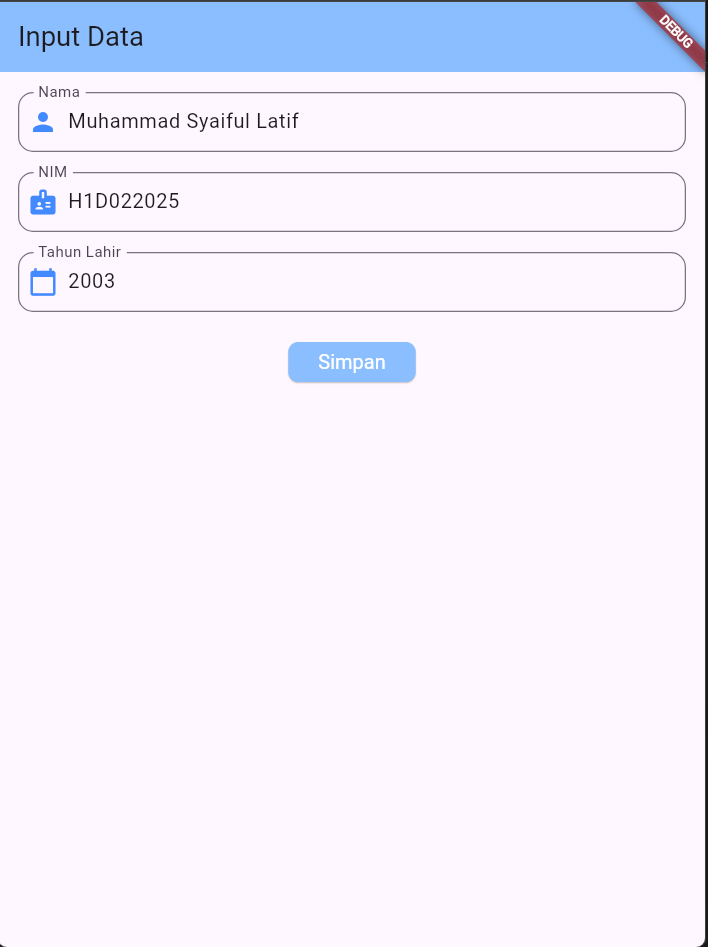
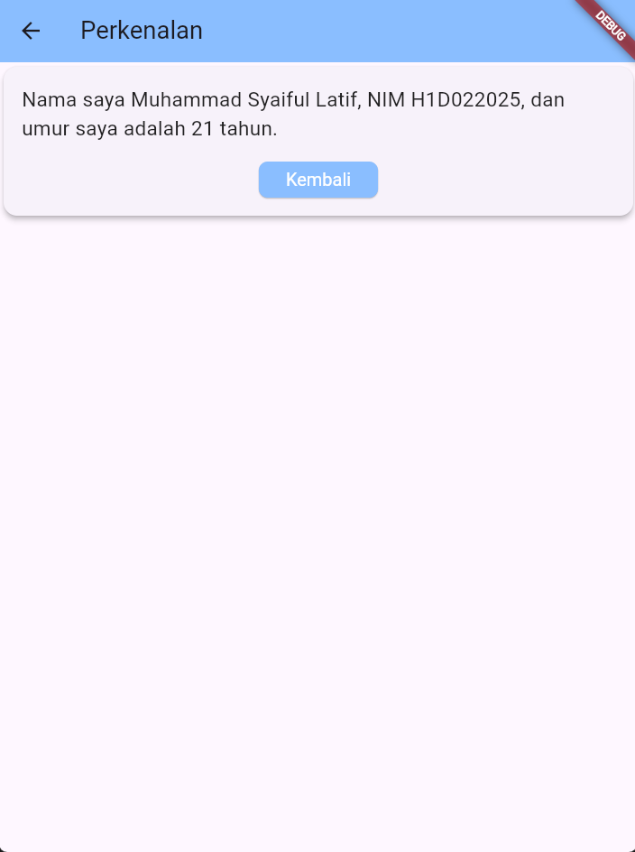

# Tugas Pertemuan 2

Nama : Muhammad Syaiful Latif

NIM : H1D022025

Shift Baru:E

jawaban :
berikut penjelasan proses passing data dari form menuju tampilan.

Pengguna mengisi formulir yang memiliki 3 input, yaitu nama, nim, dan tahun lahir. Pada fromData, terdapat 3 TextEditingController yang digunakan untuk mengelola teks yang dimasukkan oleh pengguna.
Saat tombol "Simpan" ditekan, fungsi _tombolSimpan() akan dipanggil. Nilai-nilai dari setiap TextEditingController diambil dan dikirim ke halaman berikutnya menggunakan Navigator.of(context).push().
Navigator.of(context).push() akan mengarahkan pengguna ke halaman baru (TampilData) sambil membawa data yang telah diinputkan (nama, NIM, dan tahun lahir). Data tersebut diterima di halaman TampilData melalui parameter nama, nim, dan tahun yang dideklarasikan sebagai variabel final di dalam class TampilData.

Setelah halaman TampilData ditampilkan, data yang diterima akan ditampilkan dalam bentuk teks yang telah diatur sebelumnya.

## Screenshot
Contoh :

